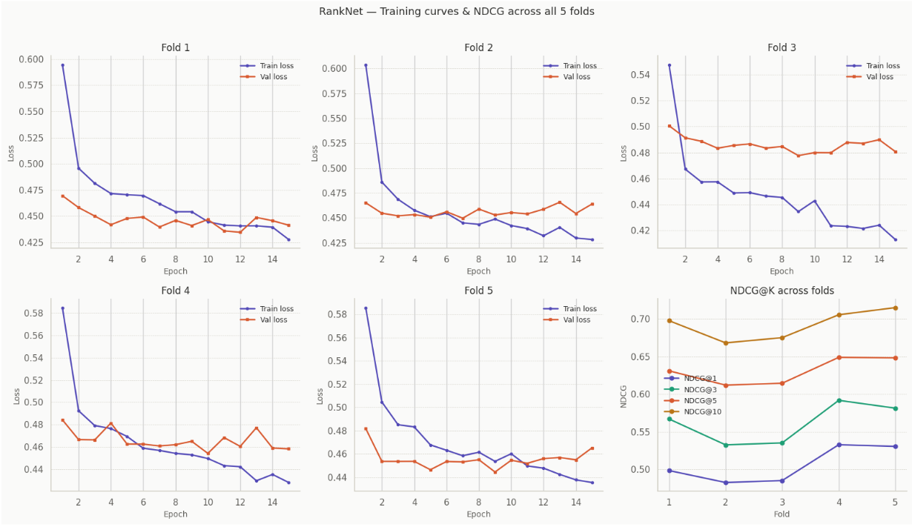

# RankNet — Learning to Rank on LETOR4 (MQ2008)

> **Pairwise Neural Ranking** · PyTorch · 5-Fold Cross-Validation · NDCG@K Evaluation

---

## Overview

This project implements **RankNet** (Burges et al., ICML 2005), a pairwise Learning-to-Rank algorithm, trained and evaluated on the **LETOR4 MQ2008** benchmark dataset.

RankNet learns to rank documents by training a neural network to predict the *relative* order of document pairs for a given query.  The model is a pointwise scorer — it assigns each document a single relevance score — but the *loss function* is pairwise, penalising the model whenever it ranks a less-relevant document above a more-relevant one.

---

## Repository Structure

```
week3/
├── README.md
├── requirements.txt
├── .gitignore
│
├── notebooks/
│   └── RankNet.ipynb          # End-to-end walkthrough (12 steps, fully annotated)
│
├── src/                       # Modular Python source
│   ├── __init__.py
│   ├── utils.py               # Seed fixing, device selection
│   ├── data.py                # LETORQueryDataset, DataLoaders
│   ├── model.py               # RankNet nn.Module (4 architecture variants)
│   ├── loss.py                # Pairwise BCE & Fidelity loss
│   ├── train.py               # Training loop with best-checkpoint saving
│   └── evaluate.py            # NDCG@K evaluation
│
├── results/
│   └── fold_training_curves.png
│
└── MQ2008/                    # LETOR4 dataset
    ├── readme.txt
    ├── Fold1/ … Fold5/        # train.txt · vali.txt · test.txt per fold
    └── *.txt                  # Full split files (S1–S5, Querylevelnorm, …)
```

---

## Dataset — LETOR4 / MQ2008

| Property           | Value                     |
|--------------------|---------------------------|
| Source             | Microsoft Research LETOR4 |
| Queries            | ~784 unique query IDs     |
| Features per doc   | 46 pre-computed IR features (TF, IDF, BM25, PageRank, …) |
| Relevance labels   | 0 (irrelevant), 1 (relevant), 2 (highly relevant) |
| Cross-validation   | 5-fold (Fold1–Fold5)      |
| Format             | libsvm                    |

**libsvm format (one document per line):**
```
<relevance>  qid:<query_id>  1:<f1>  2:<f2>  ...  46:<f46>  #docid=...
```

**Per-fold document counts (training split):**

| Fold  | Total Docs | Queries | Avg Docs/Query | Label 0 | Label 1 | Label 2 |
|-------|-----------|---------|---------------|---------|---------|---------|
| Fold1 | 9,630      | 471     | 20.45         | 7,820   | 1,223   | 587     |
| Fold2 | 9,404      | 471     | 19.97         | 7,644   | 1,196   | 564     |
| Fold3 | 8,643      | 470     | 18.39         | 6,883   | 1,189   | 571     |
| Fold4 | 8,514      | 470     | 18.11         | 6,775   | 1,205   | 534     |
| Fold5 | 9,442      | 470     | 20.09         | 7,715   | 1,190   | 537     |

---

## Model Architecture

```
Input (46)  →  Linear(46, 64)  →  ReLU  →  Dropout(0.2)
            →  Linear(64, 32)  →  ReLU  →  Dropout(0.2)
            →  Linear(32, 1)
                    ↓
             Relevance Score (scalar)
```

Four architecture variants are available in `src/model.py`:

| Variant        | Architecture            | Regularisation |
|----------------|-------------------------|----------------|
| `linear`       | 46 → 1                  | None           |
| `baseline`     | 46 → 64 → 32 → 1        | None           |
| `regularized`  | 46 → 64 → 32 → 1        | Dropout 0.2    |
| `deep`         | 46 → 128 → 64 → 32 → 16 → 1 | Dropout 0.2 |

---

## Training Setup

| Hyperparameter | Value          |
|----------------|----------------|
| Optimizer      | Adam           |
| Learning rate  | 0.001          |
| Epochs         | 15             |
| Batch size     | 4 queries      |
| Loss function  | Pairwise BCE   |
| Seed           | 42             |

---

## Results

### Baseline vs. Regularized (Fold 1, Test Set)

| Metric   | Baseline (p=0.0) | Regularized (p=0.2) |
|----------|-----------------|---------------------|
| NDCG@1   | 0.5111          | **0.5238**          |
| NDCG@3   | 0.5655          | **0.5798**          |
| NDCG@5   | 0.6289          | **0.6458**          |
| NDCG@10  | 0.7014          | **0.7116**          |

Dropout regularisation consistently improves ranking quality across all cut-offs.

### 5-Fold Cross-Validation — Regularized RankNet

| Metric  | Fold 1 | Fold 2 | Fold 3 | Fold 4 | Fold 5 | **Mean** | **Std** |
|---------|--------|--------|--------|--------|--------|----------|---------|
| NDCG@1  | 0.498  | 0.483  | 0.485  | 0.533  | 0.531  | **0.506** | 0.022   |
| NDCG@3  | 0.567  | 0.533  | 0.535  | 0.592  | 0.581  | **0.562** | 0.024   |
| NDCG@5  | 0.631  | 0.612  | 0.615  | 0.649  | 0.648  | **0.631** | 0.016   |
| NDCG@10 | 0.698  | 0.668  | 0.675  | 0.706  | 0.715  | **0.692** | 0.018   |

### Training Curves (All 5 Folds)



---

## Quick Start

### 1. Install dependencies

```bash
pip install -r requirements.txt
```

### 2. Run the notebook

Open `notebooks/RankNet.ipynb` in Jupyter or Google Colab for the full end-to-end walkthrough (dataset inspection → model training → ablation → 5-fold CV).

### 3. Use the `src` modules directly

```python
from src.utils   import set_seed, get_device
from src.data    import get_dataloaders_for_fold
from src.model   import RankNet
from src.train   import train_ranknet
from src.evaluate import evaluate_model_ndcg

set_seed(42)
device = get_device()

train_loader, vali_loader, test_loader = get_dataloaders_for_fold(
    base_path="MQ2008", fold_num=1, batch_size=4
)

model = RankNet(input_dim=46, architecture_type="regularized").to(device)

model, train_hist, val_hist = train_ranknet(
    model, train_loader, vali_loader,
    epochs=15, lr=0.001, device=device
)

ndcg = evaluate_model_ndcg(model, test_loader, k_list=[1, 3, 5, 10], device=device)
print(ndcg)
```

---

## Notebook Walkthrough

The notebook (`notebooks/RankNet.ipynb`) covers 12 documented steps:

| Step | Description |
|------|-------------|
| 1    | Environment setup, dependency install, GPU check |
| 2    | Dataset extraction & libsvm format inspection |
| 3    | Aggregate statistics across all 5 folds |
| 4    | Visualising dataset characteristics (label distribution, doc counts) |
| 5    | Feature analysis — dead features & twin detection |
| 6    | Query-grouped DataLoader with custom `collate_fn` |
| 7    | RankNet model architecture definition |
| 8    | Pairwise loss function (BCE & Fidelity) |
| 9    | Training loop & optimisation strategy |
| 10   | Training diagnostics — loss curves |
| 11   | NDCG@K evaluation — Baseline vs. Regularized ablation |
| 12   | Full 5-Fold Cross-Validation + summary table |

---

## Reference

Burges, C., Shaked, T., Renshaw, E., Lazier, A., Deeds, M., Hamilton, N., & Hullender, G. (2005).
**Learning to Rank using Gradient Descent.**
*Proceedings of the 22nd International Conference on Machine Learning (ICML)*, 89–96.
